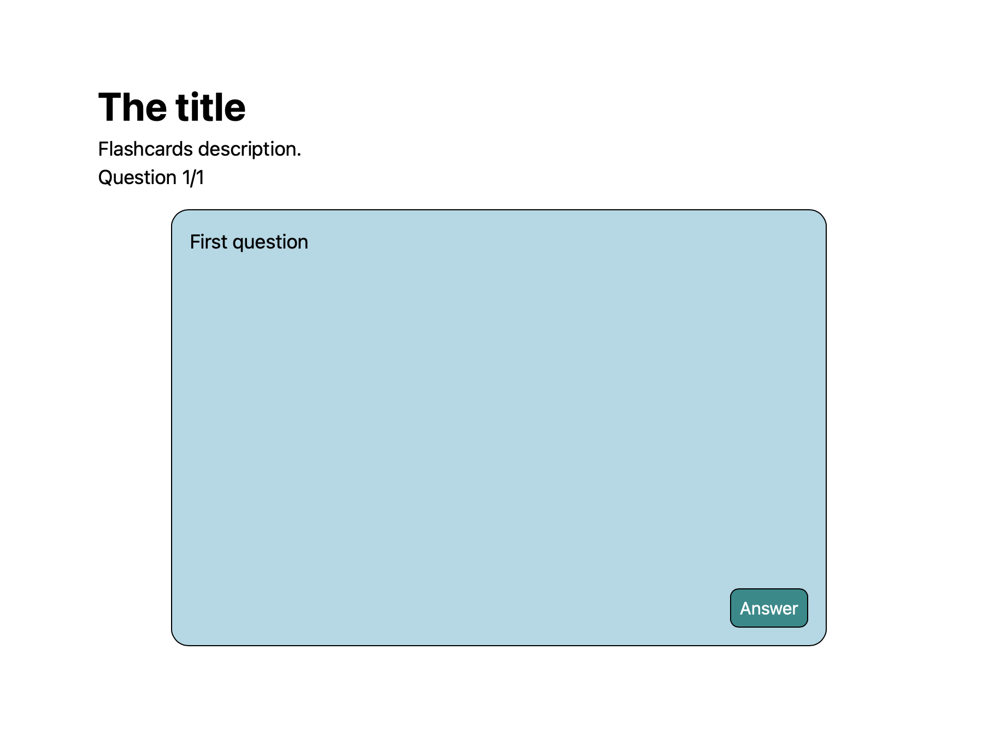
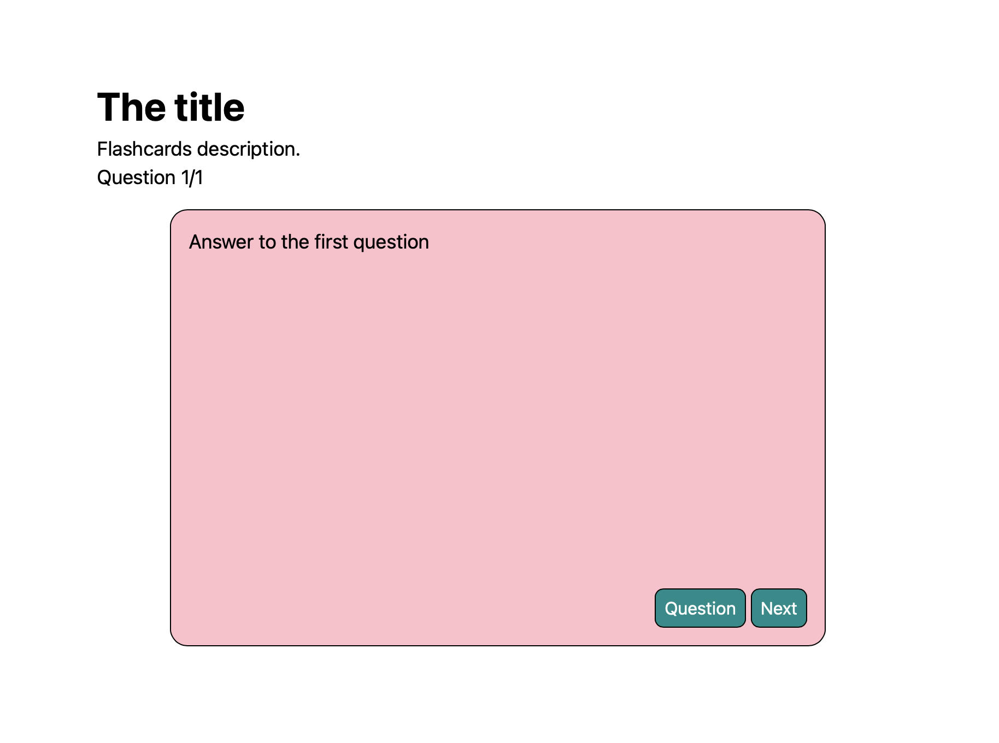

# Getting Started 
HTML is the langauge of the web. It is a markup language that we use to describe a document. 

HTML uses "tags" to amrkup the content of a document. A "tag" looks like this. 

```HTML
<p>Hello World</p>
```

The `<p>` is the opening tag, and the `</p>` is the closing tag. This tag describes the content `Hello World` as a paragraph. In this case there is an opening tag `<p>` and a closing tag `</p>`, notice the tags look the same, but the closing tag has a `/`. 

Often tags are nested one within another. 

```HTML
<header>
  <h1 id="title">The title</h1>
  <p id="description">Flashcards description.</p>
  <p id="score">Question 1/1</p>
</header>
```

Here the `h1`, and two `p` tags are within the `header` tag. 

Notice the tags have many different names. In HTML the tags all provide some context or meaning to the content they contain. 

- The `header` tag says that this is a header. A header might have the title and other information that leads into a story or article. 
- `h1` is a heading, a heading usually contains the title of a story, article, or section. Think about how you write. A new section might start with a title. In an HTML document you would use a heading tag to describe this. 
- `p` is a paragraph. A paragraph is a block of text that contains a complete idea. The p tag lets you describe that. 

## Create an HTML document
Every HTML document will share some features. 

Create a new file in your code editor. Save this as `index.html`. 

An html document, is a plain text document with the `.html` file extension. 

The name `index.html` is used for the root, or starting document for a website. 

Every HTML document uses the same "boilerplate" code. Add this to `index.html`:

```HTML
<!DOCTYPE html>
<html lang="en">
<head>
  <meta charset="UTF-8">
  <meta name="viewport" content="width=device-width, initial-scale=1.0">
  <title>Document</title>
</head>
<body>
  
</body>
</html>
```

Examine the code above and find the items described in the list below. 

- `<!DOCTYPE html>` is a special tag that doesn't follow the rules! This tag says what type of HTML you writing. In this case you are writing HTML5. 
- `<html></html>` is the html tag. This tags describes it's content as a n HTML document. Everything else you add to this document must be inside the `<html>` and `</html>` tags!
- `<head></head>` contains meta information about the document. 
- `<meta>` defines some meta information about document. 
- `<title></title>` defines the title of the document. The title is displayed at the top of the window or in the tab above the page. 
- `<body></body>` the body tag contains everything that appears within browser window. This actual content of the web page. 

Notice the `<meta>` tags don't have a closing tag (`</meta>`). Some tags don't have a clsoing tag. 

Many of the tags have extra information in the opening tag. For example, `<html lang="en">` also includes `lang="en"`, and `<meta name="viewport" content="width=device-width, initial-scale=1.0">` includes `name="viewport"` and `content="width=device-width, initial-scale=1.0"`. These are called attributes. 

Attributes add extra information to tags. A tag can have as many attributes as you like. Attributes are always in the form of `name="value"`, where the value is always in quotes. 

Read about the tags in the HTML5 tag list: https://developer.mozilla.org/en-US/docs/Web/HTML/Element#main_root

## Making a Flashcard document
If we were going to make an HTML document that described some flashcards what would we write? 

Before we write anything lets think about what needs to be displayed? 

- Title of the flash card set
- Description of the questions
- Number of cards
- Flashcard question
- Button to show the answer
- Flashcard answer 
- Button to show the question
- Button to show the next card

I imagined a page that looks like this.



When you click the "Answer" button it looks like this.



Using your imagination, imagine that the question card "flips" over to reveal the answer card. 

### Marking up the flashcard document
Lets walk through marking up this page. 

Start with the header. This contains the title of the flash cards set, a description of the flashcards, and the number of the current card in the set. 

```HTML
<!DOCTYPE html>
<html lang="en">
<head>
  <meta charset="UTF-8">
  <meta name="viewport" content="width=device-width, initial-scale=1.0">
  <title>Flash Cards</title>
</head>
<body>
  <main>

    <header>
      <h1 id="title">The title</h1>
      <p id="description">Flashcards description.</p>
      <p id="score">Question 1/1</p>
    </header>

  </main>
</body>
</html>
```

I used the `main` tag to wrap everything. This tells the browser that this is the "main" content of the page. 

Notice, I used the `<header>` and placed it within the `<body>`. 

Inside the header I included three elements. 
- h1 - will contain the title of the flashcards set
- p#description - will contain a description of these flashcards
-  p#score - will show the number of the current flashcard and the total number of cards, like this 1/5

Notice that I gave each of these three elements an `id` attribute. This is a name you can assign to something. You can make up any name you like, the name will be used to control this element with JavaScript. 

Next add a container element for the cards. This will give us a way to group the some elements together this will help with styling and JavaScript. 

```HTML
<main>
    <header>
      <h1 id="title">The title</h1>
      <p id="description">Flashcards description.</p>
      <p id="score">Question 1/1</p>
    </header>

    <div id="q-container">

    </div>

  </main>
```

Notice the new div has an `id` "q-container". The id will the code we write to identify this element. We can apply styles to it, and control its behavior with JavaScript. 

Notice that we put the new element inside the existing `<main>` element. Everything will go inside `<main>`.

Next we need two cards, one displays the question, and the other displays the answer. The question card will have a button to display the answer, while the answer card will have two buttons, the first display the question, and the second will display the next question. 

Keep your eye on the `id` names. This will help you identify where to place new code!

The card will flip, rotating around it's vertical axis. To make that work we need "parent" element to surround both cards. 

```HTML
<div id="q-container">
  <div id="flip-card">

  </div>
</div>
```

Next add the question card. 

```HTML
<div id="flip-card">
  <div id="q-card">
    <p>First question</p>
    <button id="answer-button">Answer</button>
  </div>

</div>
```

Now add the answer card. 

```HTML
<div id="flip-card">
  <div id="q-card">
    <p>First question</p>
    <button id="answer-button">Answer</button>
  </div>

  <div id="a-card">
    <p>Answer to the first question</p>
    <div>
      <button id="question-button">Question</button>
      <button id="next-button">Next</button>
    </div>
  </div>

</div>
```

Important! id names must be unique! That is, you should only use any id name once per page! 

Important! naming things is one of the most impirtant things you'll do as a programmer. When you assign an id name to something, think about the name the name. Choose something that describes the element, that you will remember, and that others will intuit purpose. 

When you're done your page should like this: 

```HTML
<!DOCTYPE html>
<html lang="en">
<head>
  <meta charset="UTF-8">
  <meta name="viewport" content="width=device-width, initial-scale=1.0">
  <title>Flash Cards</title>
</head>
<body>
  <main>
    <header>
      <h1 id="title">The title</h1>
      <p id="description">Flashcards description.</p>
      <p id="score">Question 1/1</p>
    </header>

    <div id="q-container">

      <div id="flip-card">
        <div id="q-card">
          <p>First question</p>
          <button id="answer-button">Answer</button>
        </div>

        <div id="a-card">
          <p>Answer to the first question</p>
          <div>
            <button id="question-button">Question</button>
            <button id="next-button">Next</button>
          </div>
        </div>
      </div>
      
    </div>

  </main>
</body>
</html>
```

Compare your work! 

## The DOM
We refer to the HTML document as the DOM, or Document Object Model. The DOM has a tree structure that your code can traverse. This is an important concept that underlies almost everything in computer science! 

What is the DOM? When an HTML document is loaded into the browser, the browser reads the HTML code it contains, and then builds a data structure from the HTML. 

The applications you create will want to do things with the elements created in the DOM, like change the appearance, update the content. To do that you'll write code that targets DOM elements. 

You can think of the DOM like a tree. Imagine the trunk of the tree splitting into branches and ending in leaves. 

The `html` element is like the trunk of the tree. We can say it is the "ancestor" of all of the other elements. 

The `html` element has two "child" nodes the `head` element and the `body` element. We can say that `html` is the parent of `head` and `body`. 

You can describe the `h1` element as a child of `header` and as a "descendent" of `main`, `body`, and `html`. 

We can describe `h1#title`, `p#description`, and `p#score` as simblings. 

Think about the terms: Parent, Child, Sibling, Ancestor, and Descendent. Consider the HTML above and apply the terms to describe the relationships between the elements there. I'll be using these terms as you progress through the tutorial. 

## Conclusion 
If you followed this step of the tutorial you learned: 
- How to write HTML tags
- Create a default HTML document
- Add attributes to tags
- Assign id names to elements
