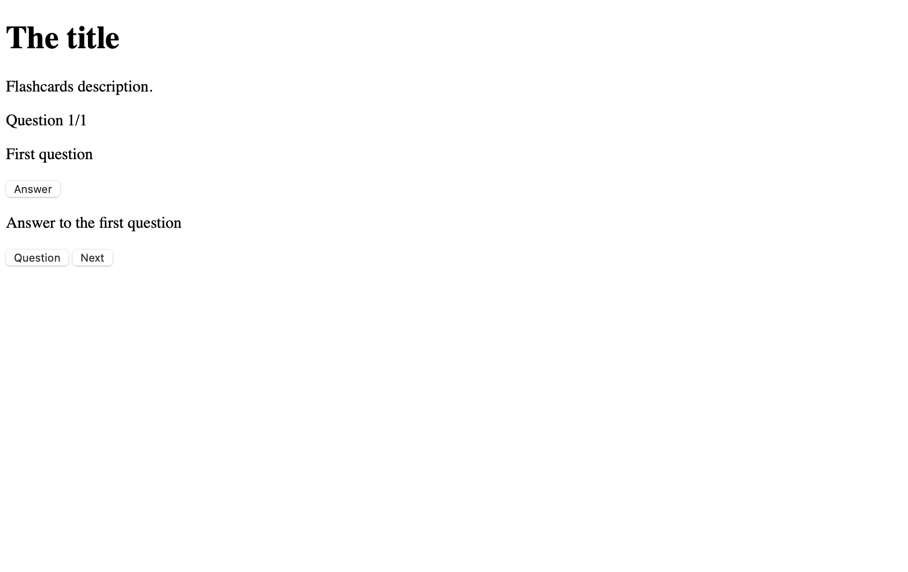

# Adding Styles 
The appearance of your webpages is dtermined by the styles you apply. Styles are written in the CSS language. 

The browser applies some default styles. You can ignore these. Never let the default appearance affect the tags you choose. Allways choose the tag that best describes the contents it contains! 

So far your page should look something like this if you view it in a browser. 



Try opening your index.html file in your web browser. 

This far from our goal of this. 


Notice! all of the elements exist they just look different. You don't see the Answer card, div#a-card, becuase the CSS styles have "flipped" over and positioned it under the Question card! 

## Adding a Stylesheet
Styles are written in the CSS language, most often we put them in their own file. 

Create a new file, and name it `styles.css`. Save this file to the same folder as `index.html`. 

Link your stylesheet to your HTML document by adding a link tag. Add the following inside the `head` tag. 

```HTML
<head>
  ...
  <link href="styles.css" rel="stylesheet">
</head>
```

The link tag can be used for a few purposes. Here you linking to your stylesheet, so you include the attribute `rel="stylesheet"`, and use `href="styles.css"` to link to your style shee file, the name `styles.css` has to match the name of your stylesheet, and they must be in the same folder! 

## Wrtiting CSS
CSS is writting in "rules". A rule is made of "selector" followed by a "block". 

The "selector" selects elements in the DOM. Think of the selector as describing the elements you are targeting. 

The block contains properties and values that are applied to the elements that selector describes. 

Here is an example: 

```CSS
body {
  font-family: Helvetica;
  font-size: 18px;
}
```

In the rule above, the selector is `body` and the block is everything inside the `{ }`. This rule sets the `font-family` and `font-size` of the body tag to the values: `Helvetic` and `18px`.

### Selectors 
Selectors come in a wide variety! They all work with the DOM and it's tree structure. Here are a few selectors that we will use: 

**Type selector** selects an element by the tag name. For example `body` would select the body tag, `button` selects all of the `<button>` tags. 

**Id Selector** selects an element by its id name. When you use the id selector you always precede the name with `#`. For example: 

```CSS
#answer-button {
  position: absolute;
  right: 1rem;
  bottom: 1rem;
}
```

The CSS above selects the button with the id name "answer-button". 

Some selectors are more complex. 

**The group selector** allows you to select elements that match more than one selector. For example: 

```CSS
html, body {
  height: 100%;
}
```

The rule above uses the selector `html, body` to select **both** the `<htmel>` and `<body>` elements, the height of both is set to 100%. Its the comma `,` that makes this the group selector! 

There are a lot more selectors! We will take a look at more of these later in the course. 

## Styling the Flashcards
Now we have an idea of of how CSS is written lets start writing some! 

Add the following rules your `styles.css`. I recommend having your `index.html` open in the browser while you do this, this way you can see the affects of each rule on your page. Connecting the cause and effect of the CSS and what the browser displays will help you understand how CSS works! 

Start with this. 

```CSS
html, body {
  height: 100%;
}
```

This rule will not produce anything obviously visible. We need this in order to be able to center the flashcard vertically in the page. 

```CSS
* {
  margin: 0;
  padding: 0;
  box-sizing: border-box;
}
```

This rule removes the default margin and padding from all elements. The selector `*` selects all elements! This rule is used because many elements have default padding and margin, the space around things, that gets inthe way and needs to be adjusted. Here we removed the margin and padding, and later we will add margin and padding where needed. 

```CSS
body {
  font-family: system-ui, -apple-system, BlinkMacSystemFont, 'Segoe UI', Roboto, Oxygen, Ubuntu, Cantarell, 'Open Sans', 'Helvetica Neue', sans-serif;
  font-size: 18px;
  line-height: 1.45;
}
```

This rule applies to the body element. Most CSS properties are inherited by their descendents. By setting the `font-family` and `font-size` on the body all of elements inside the body tag will "inherit" these values. 

The long list of fonts is there as a fall back. The system will use the first font that is compatible. This makes our work on different systems that may have different fonts installed. 

```
system-ui, -apple-system, BlinkMacSystemFont, 'Segoe UI', Roboto, Oxygen, Ubuntu, Cantarell, 'Open Sans', 'Helvetica Neue', sans-serif
```

```CSS
main {
  height: 100%;
  min-width: 600px;
  max-width: 80%;
  margin: auto;
  display: flex;
  flex-direction: column;
  justify-content: center;
}
```

Main is where all of the content of our app resides. The rules give this element a minimum width of 600px or a width of 80% of the window. 

The property `margin:auto` centers the element horizontally. 

The property `display:flex` turns this into a flex container. Flex containers arrange their "children" along an axis, horizontal or vertical. The `flex-direction: column` property sets the axist to vertical, and `justify-content: center` arranges everything in the center of that vertical axis. 

Read more about Flex Box here: https://css-tricks.com/snippets/css/a-guide-to-flexbox/

Now style the cards. There are two cards, one displays the question, and the other displays the answer. In a later step you will arrange these so one covers the other. For now they will appear together. 

```CSS
#q-container {
  width: 600px;
  height: 300px;
  margin: 1rem auto;
  position: relative;
  perspective: 900px;
}
```

Here you set the width to 600px, and add a margin of `1rem auto`. The two values for margin set the vertical margin to 1rem and the horizontal margins to auto which makes the margins on the left and right equal. 

Read abour rem as a unit here: https://stackoverflow.com/questions/78222705/understanding-the-css-unit-rem

In short a rem is equal to the root em, an em is equal to the font size. Since the font size of the root element, the body tag, is 18px, a rem is 18px, in this project. 

Position sets the positioning method used by an element. Read more about it here: https://www.w3schools.com/css/css_positioning.asp

We used `position: relative` here so later when we `position: absolute` on descendent elemnts they will use this element as their reference. 

Later when add the flip effect, the `perspective: 900px` value will make the effect appear 3d. Read about perspective: https://css-tricks.com/almanac/properties/p/perspective/

Style the question and answer cards. 

```CSS
#q-card, #a-card {
  width: 100%;
  height: 100%;
  padding: 1rem;
  /* position: absolute; */
  /* backface-visibility: hidden; */
  border: 1px solid;
  border-radius: 1rem;
}
```

This should give you two cards with a rounded border. 

Remove the comment around `position: absolute;`. Notice the cards are now stacked on top of each other. 

Lets make each of the cards a differnt color. 

```CSS
#q-card {
  background-color: lightblue;
}

#a-card {
  background-color: pink;
  transform: rotateY(180deg);
}
```

Here you styled the cards blue and pink.

Notice the answer card has been flipped over, as if it were rotated 180 degrees on its vertical axis. 

Go back to the `#q-card, #a-card` rule. Uncomment the line `backface-visibility: hidden;`. This property makes an element only visible from the front. When you un comment this the card that is flipped is no longer visible. 

Uncomment the line `position: absolute;`. This places the answer card underneath the question card. Visualize both cards being back to back. 

For now comment these two lines: 

```CSS
/* position: absolute; */
/* backface-visibility: hidden; */
```

This way you'll be able to see both cards while you style them. Later you'll remove these comments when everything is ready. 

Take a look at the HTML for the cards:

```HTML
...
<div id="q-card">
  <p>First question</p>
  <button id="answer-button">Answer</button>
</div>

<div id="a-card">
  <p>Answer to the first question</p>
  <div>
    <button id="question-button">Question</button>
    <button id="next-button">Next</button>
  </div>
</div>
...
```

Notice that the `div#q-card` has a single button, and `div#a-card` has two buttons inside of a `div`. We want to place the buttons in the lower right. We can do that with `position: absolute` with the help of `position: relative` on our ancestor! 

First style all of the buttons: 

```CSS
button {
  border: 1px solid black;
  padding: 0.5rem;
  border-radius: 0.5rem;
  background-color: darkcyan;
  color: white;
  font-size: 1rem;
}
```

Now move the answer button to the lower right. 

```CSS
#answer-button {
  position: absolute;
  right: 1rem;
  bottom: 1rem;
}
```

It looks like it's in outisde the box. This will be fixed when the parent is `position: absolute`. 

There are two buttons in the answer card, move their div container: 

```CSS
#a-card > div {
  position: absolute;
  right: 1rem;
  bottom: 1rem;
} 
```

Now uncomment the two lines: 

```CSS
#q-card, #a-card {
  ...
  position: absolute;
  backface-visibility: hidden;
  ...
}
```

This should put everything in the right place. The answer card will not be visible because it is hidden undneath the question card!

## Conclusion 
In this tutorial you learned how to apply styles, writing rules in the CSS langauge. You used selectors to set the properties of specific elements in the DOM. 

This example uses some sophisticated CSS, flex box, absolute and relative position are advanced CSS topics! 
